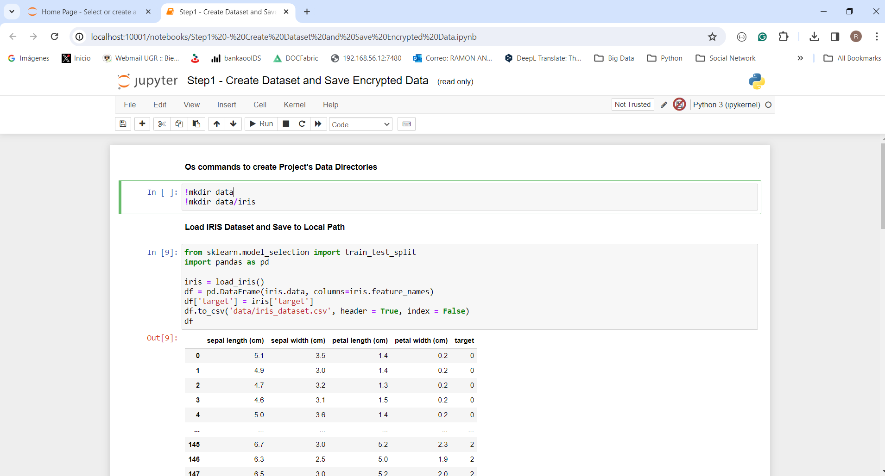
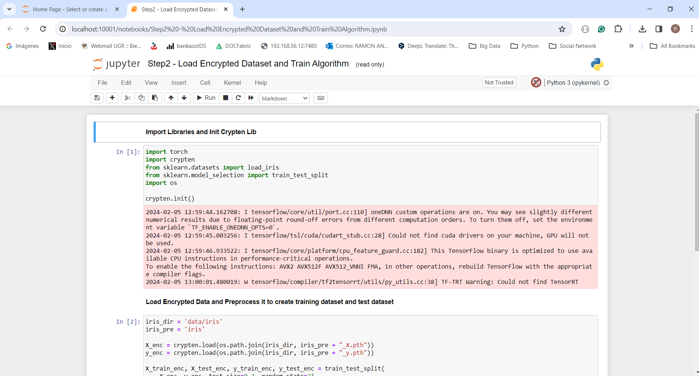

#  Confidential-ML 

The following project highlights the implementation of an AI Algorithm using Full Homomorphic Encryption (FHE), Using the library Crypten, we show a process of training a Linear Regression with an approach focused on safeguarding data privacy and confidentiality. This approach is aligned with Deitos Network's vision, proposing a secure distribution of data in public infrastructures dedicated to AI training and deployment.

##  Run 

Build a Docker image for POC using fhe-examples-poc
```console
docker build -t img-confidential-ml .
```

Create a Docker container with the image buislt
```console
docker run  --name jupyter-confidential-ml -p 10001:8888 img-confidential-ml
```

Access the Jupyter console with Web Browser
[Jupyter Console](http://localhost:10001/) 

## Examples

The example provided is designed in two steps, a first step that has to do with generating the training data encrypted with the Cryptend library, from an example dataset from the SciKit-Learn library called IRIS and a second that uses This encrypted data to train a linear regression algorithm.


[Step1 - Create Dataset and Save Encrypted Data](http://localhost:10001/notebooks/Step1%20-%20Create%20Dataset%20and%20Save%20Encrypted%20Data.ipynb) This example loads an example dataset from the Scikit Learn library, stores it on disk, then loads it from the local file system, trains an artificial intelligence algorithm, encrypts the data used and finally stores it on the local disk. In detail shows the following steps:
1. Run operating system commands to create the project data directories.
2. Load the IRIS Dataset using the Scikit Learn library and perform the necessary steps to store it in the local file system in CSV Format
3. The CSV file is uploaded and used to train a Linear Regression algorithm
4. The data used for training and testing the algorithm is encrypted with Crypten Lib and stored in the local file system





[Step2 - Load Encrypted Dataset and Train Algorithm](http://localhost:10001/notebooks/Step2%20-%20Load%20Encrypted%20Dataset%20and%20Train%20Algorithm.ipynb) This example loads encrypted training and uses it to train a linear regression algorithm provided by the Scikit-Learn library. In detail, the following steps are executed:
1. Loads the encrypted data from the local disk using Crypten Lib and prepares it for feeding to a linear regression algorithm.
2. Run the training of a linear regression algorithm with encrypted data





> Note: In the illustration of the example's execution, it becomes evident that the inference results for the model trained with encrypted data exhibit lower precision compared to the model trained with data in a flat format. This discrepancy underscores the challenge of managing the inherent noise introduced into the model due to the utilization of an FHE (Fully Homomorphic Encryption) scheme during training with encrypted data. 
