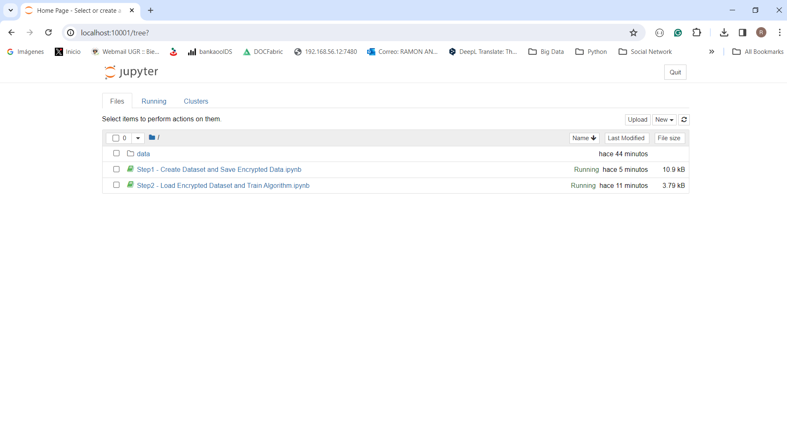

#  Confidential-ML 

The following project highlights the implementation of an AI Algorithm using Full Homomorphic Encryption (FHE), Using different Libraries based on FHE, for example, TenSEAL, Crypten, and tf-encrypted, we show a process of training a Linear Regression with an approach focused on safeguarding data privacy and confidentiality. This approach is aligned with Deitos Network's vision, proposing a secure distribution of data in public infrastructures dedicated to AI training and deployment.

##  Run 

Build a Docker image for POC using fhe-examples-poc
```console
docker build -t img-confidential-ml .
```

Create a Docker container with the image built
```console
docker run  --name jupyter-confidential-ml -p 10001:8888 -v .\notebook:/home/jovyan/work img-confidential-ml
```

Access the Jupyter console with Web Browser



Run the tf-encrypted notebook


## Examples
The project include a set of examples regarding to Crypten libs to advance in train and deploy models of AI, assuring data privacity.

 : Show the process to download a sample dataset IRIS provided by SciKit Learn Library, encrypt data in FHE mode and save it in disk.
 
 : Show the process to load a sample dataset encrypted in FHE mode to train a Lineal Regression algorithms provided by Scikit Learn.

